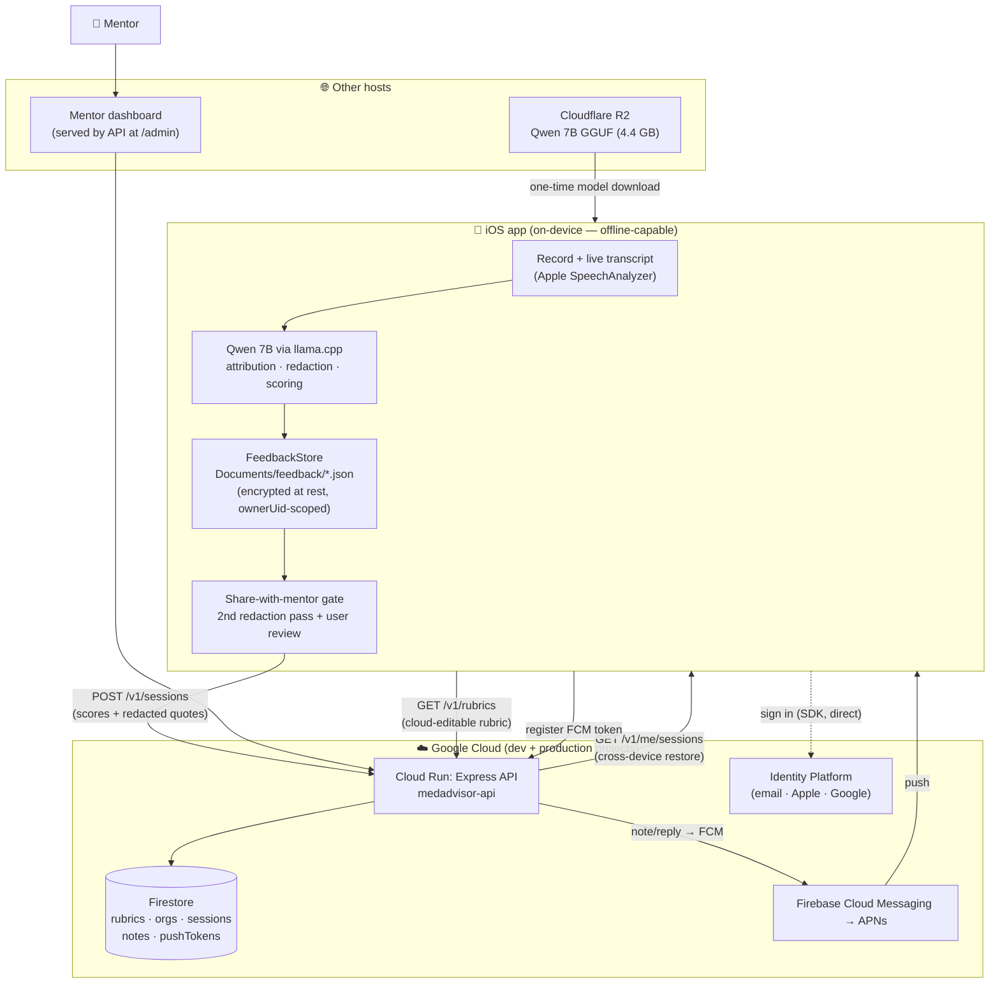
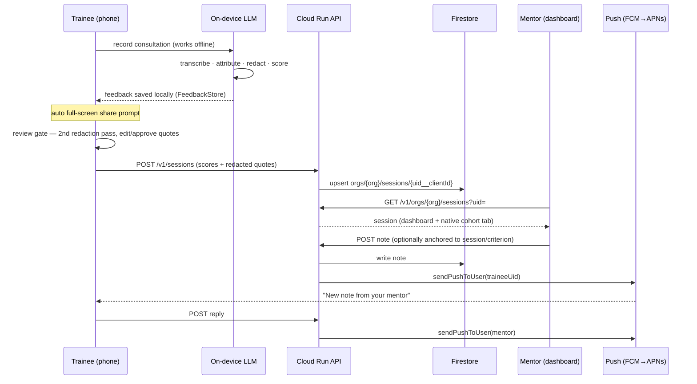

# MedAdvisor — System Architecture

Whole-system reference: the iOS app (on-device AI), the Cloud Run API,
Firestore, auth, push, and model delivery. Two repos: `medadvisor` (app) and
`medadvisor-cloud` (this — server + dashboard).

## Core principle

**The AI never leaves the phone. Only redacted, user-approved results sync.**
Recording, transcription, speaker attribution, PHI redaction, and rubric
scoring all run on-device with the Qwen 7B model. What can travel to the cloud
is exactly the Tier-2 payload: per-criterion scores + short **redacted**
evidence quotes — never audio, never the transcript.

## Component / data-flow diagram



## Record → share → mentor → push (sequence)



## Storage model — who holds what

| Data | On device | In cloud (Firestore) |
|---|---|---|
| Audio | deleted after analysis | never |
| Transcript / turns | yes (encrypted, never leaves) | **never** |
| Scores + redacted quotes | yes | only if shared (`orgs/{org}/sessions`) |
| Chat (notes + replies) | pulled from cloud, not persisted | yes (`orgs/{org}/notes`) |
| Rubrics | bundled + cached copy | source of truth (`rubrics`) |
| Accounts / org membership | token only | Identity Platform + `orgs/{org}/members` |

- **Local is primary** for a trainee's own history; cloud holds only shared
  sessions (and without the transcript).
- Records are **owner-scoped** on device (`ownerUid`): after sign-out they stay
  on disk but are filtered from view; they reappear when that user signs back
  in. Another user only ever sees their own + anonymous records.
- **Restore** (lost/new phone): a trainee signing in pulls their shared sessions
  back via `GET /v1/me/sessions`. Unshared sessions are device-only and are not
  recoverable — see "open questions" in PLAN.md re: a private backup tier.

## Firestore collections

```
rubrics/{rubricId}                      the pristine rubric document (cloud-editable)
inviteCodes/{CODE}                      { orgId, role, active, maxUses, uses, expiresAt }
orgs/{orgId}                            { name, createdAt, createdBy }
  members/{uid}                         { role, email, displayName, joinedAt }
  sessions/{uid__clientSessionId}       { uid, recordedAt, receivedAt, location,
                                          rubricId, rubricVersion, summary,
                                          criteria:[{id,dimension,result,evidence,tip}] }
  notes/{noteId}                        { traineeUid, sessionId?, criterionId?,
                                          authorUid, text, createdAt, replies:[…] }
  retractions/{sessionId}               { traineeUid, recordedAt, retractedAt }  (contentless)
users/{uid}/pushTokens/{token}          { platform, lastSeenAt }
```

Firestore is a document (NoSQL) store — each `{…}` above is a JSON-like
document (typed fields, nested maps, arrays, server timestamps). Client access
is deny-by-default; only the API (Firebase Admin SDK) reads/writes.
